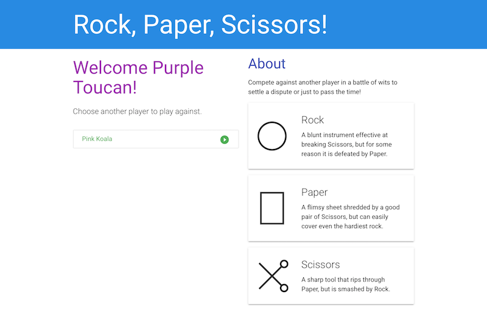

# Multiplayer RPS

UCSD Coding Bootcamp HW Assignment 07

An exercise in MVC architecture and Material UI design. Play rock-paper-scissors with other people online. Keep track of wins, losses, and draws.

[Play the game here](https://quells.github.io/ucsd0725-Multiplayer-RPS/), and share with a friend!

#### Somewhat interesting tech

- Keeps track of all game logic and player connections in the browser. Uses Firebase as a key-value store and communication channel.
- Implemented [a system](https://github.com/quells/ucsd0725-Multiplayer-RPS/blob/51f643731b9ed2eacb7f48a0d0cce25d1be4cc5a/assets/js/model.js#L28) for external consumers to register callbacks to be triggered after certain events, sort of inspired by reactive (rx\*) frameworks
- Implemented [a way](https://github.com/quells/ucsd0725-Multiplayer-RPS/blob/51f643731b9ed2eacb7f48a0d0cce25d1be4cc5a/assets/js/utils.js#L1) to calculate diffs between objects to help notice what has changed between two states (done in the most naive way possible, so probably slow for large/nested objects)

## Changelog

### 1.0 - September 22, 2017

Minimum viable product.

